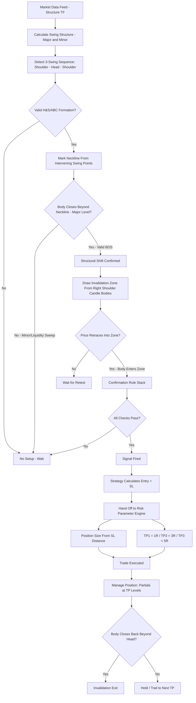

# Advanced Price Action (APA) — Deterministic Implementation Plan (AlgoEdge)
## v2 — Optimized against Michael FX / Forex Course Academy's A.P.A. framework

**System philosophy:** unchanged from v1 — fully rule-based structure/pattern formulas, no ML, no Monte Carlo, no separate testing layer. Strategy calculates entry + SL only; the Risk Parameter Engine owns TP1–TP5.

**What changed from v1:** v1 used generic candlestick patterns (pin bar/engulfing/inside bar) triggered at generic S/R zones. This source describes one specific, more testable setup instead — a Head-and-Shoulders / ABC structural reversal with a defined "Invalidation Zone" retest entry — which now replaces that as the core pattern. Generic candlestick patterns are dropped as the primary trigger.

---

## 1. Visual Flow

---

## 2. Comparison: v1 vs. this source

| Element | v1 (generic APA) | Michael FX / A.P.A. (this source) |
|---|---|---|
| Core setup | Candlestick pattern at any S/R zone | Specific Head & Shoulders / ABC structural reversal |
| Entry trigger | Pattern completion (pin bar, engulfing, inside bar) | Retest of the "Invalidation Zone" (shoulder level) after BOS |
| Zone drawn from | Swing point clusters | Candle **bodies** of the shoulder formation specifically |
| BOS validity | Any structure break | Must break a **major** level — body close, not wick; filters liquidity sweeps |
| SL placement | Beyond pattern wick / zone / swing (3 options) | Beyond the **wick** of the shoulder specifically (or both head+shoulder wicks if levels are tight) |
| TP philosophy | N/A — deferred to risk engine | **Forward-looking**: targets future untested structural highs/lows, not prior reaction levels — the source's explicit differentiator from SMC/ICT |
| Timeframes shown | Unspecified | 15-min structure / 5-min entries |

---

## 3. Step-by-Step Implementation Plan

1. **Ingest bars** on a structure timeframe (default 15-min) and an entry timeframe (default 5-min), matching the source's demonstrated pairing.
2. **Calculate swing structure on two tiers**: *minor* swings (fractal M=3, tight lookback — for shoulder/head detection) and *major* swings (fractal M=8+, wider lookback — for BOS validity). This formalizes "major vs minor breakout."
3. **Detect a 3-point swing sequence** matching Shoulder → Head → Shoulder: the middle swing point (Head) exceeds both neighboring swing points (Shoulders) in the same direction; the two Shoulders fall within a tolerance band of each other (default 0.3×ATR).
4. **Mark the neckline**: the intervening swing low(s) (bearish case) or swing high(s) (bullish case) between Head and each Shoulder.
5. **Check BOS validity**: candle **body** (not wick) closes beyond the neckline, **and** that neckline level coincides with a *major* swing level from step 2. A break of only a *minor* level is treated as a liquidity sweep — no BOS, no trade.
6. **Draw the Invalidation Zone**: a box bounded by the candle **bodies** of the Right Shoulder formation (not wicks).
7. **Wait for retest**: price must retrace and a candle **body** must re-enter the Invalidation Zone.
8. **Run the Confirmation Rule Stack** (§4).
9. **If all checks pass** → signal fires → calculate entry and SL (§5).
10. **Hand off** direction, entry, SL to the Risk Parameter Engine (§6) — unchanged from v1.
11. **Manage the position**: hard invalidation if a candle body closes back beyond the Head level before TP1 — the pattern's structural thesis is void at that point.
12. **Re-arm** once flat.

---

## 4. Confirmation Rule Stack

1. Valid 3-point Shoulder-Head-Shoulder sequence detected (step 3).
2. BOS confirmed on a **major** level via body close (steps 4–5).
3. A candle body has entered the Invalidation Zone on retest (steps 6–7).
4. Tight-levels check: if Head and Shoulder sit within 0.2×ATR of each other, SL calculation must switch to cover both (see §5), not just the nearer one.
5. No conflicting open position already exists on this instrument.

---

## 5. Strategy-Owned SL Formula

- **Default**: SL = beyond the **wick** extreme of the Right Shoulder + small buffer (default 0.05×ATR).
- **Tight-levels case**: if Head and Shoulder are within 0.2×ATR of each other, SL = beyond the wick extreme of the **Head** instead — covers both levels in one stop, per the source's explicit rule.

This stays the only risk figure the strategy calculates.

---

## 6. Risk Parameter Engine Hand-off — unchanged

| Tier | R-Multiple | Ratio | Used by default |
|---|---|---|---|
| TP1 | 1R | 1:1 | Yes |
| TP2 | 3R | 1:3 | Yes |
| TP3 | 5R | 1:5 | Yes |
| TP4/TP5 | — | — | Available, off by default |

**Flag — a philosophy conflict worth a decision:** this source's stated edge over SMC/ICT is a *forward-looking* TP — targeting the next untested structural swing ahead of price, not a fixed R-multiple. Your risk engine's TP1/2/3 grid is fixed-R by design. Two options:
- **Keep the R-multiple grid as-is** (consistent with every other AlgoEdge strategy, simplest) — this plan does that by default.
- **Log the structural target as a reference field only** (next major swing high/low ahead, calculated but not used to place the live TP order) so you can compare, per trade, whether the fixed R-grid over- or under-shoots where the source's method would have exited. Doesn't touch the risk engine's ownership of TP — purely a diagnostic field on the signal record.

---

## 7. Instrument-Class Notes — unchanged

| Instrument class | Exit-on-invalidation |
|---|---|
| Deriv synthetics (24/7) | Hard flatten on Head-level body close |
| Prop firm FX/metals/indices (FundedNext, Bloom Funded, etc.) | Hard flatten — avoid reversing into new exposure against daily-loss/consistency rules |

---

## 8. Tunable Parameters

| Parameter | Default | Range to try | Effect |
|---|---|---|---|
| Structure timeframe | 15-min | 15-min–1H | Higher = fewer, higher-conviction H&S formations |
| Entry timeframe | 5-min | 1-min–15-min | Lower = tighter entries, more noise on the retest trigger |
| Minor swing fractal (M) | 3 | 2–5 | Shoulder/Head detection sensitivity |
| Major swing fractal (M) | 8 | 6–15 | Higher = stricter BOS filter, fewer but more valid breaks |
| Shoulder symmetry tolerance | 0.3×ATR | 0.15–0.5×ATR | Wider = more formations qualify as valid H&S/ABC |
| Tight-levels threshold | 0.2×ATR | 0.1–0.4×ATR | Controls when SL switches to cover both Head+Shoulder |
| SL buffer | 0.05×ATR | 0–0.15×ATR | Extra room beyond the wick stop |
| Invalidation zone source | Right Shoulder body | Right Shoulder / Left Shoulder / both | Which candle bodies define the retest box |
