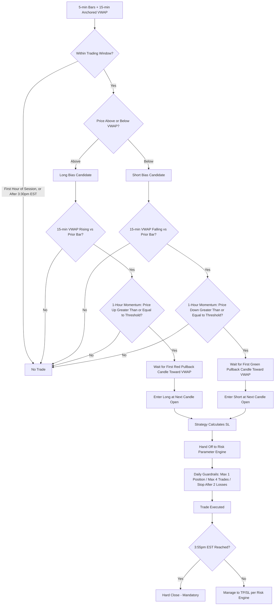

# VWAP Strategy — Deterministic Implementation Plan (AlgoEdge)
## v2 — Optimized against Matteo Conti's "Drift VWAP Pullback" (Golden Ticket VWAP)

**System philosophy:** unchanged — fully rule-based. The entry/exit/session rules below are all deterministic formulas.

**Excluded on purpose:** the source leans heavily on Monte Carlo simulation for edge validation, drawdown-boundary setting, and prop-firm pass-probability modeling. None of that is in this plan — per your stated preference for a fully rule-based system with no separate testing/validation layer, only the deterministic trading rules were extracted. Where the source used a Monte Carlo-derived drawdown boundary, §7 substitutes a plain fixed-threshold kill switch instead — same protective intent, no simulation involved.

**Source credibility note:** unlike v1's SSRN paper, this is a single trading-education video ("Golden Ticket" framing is promotional). The ~64–65% win rate and NQ backtest figures are the creator's own claims, not independently published. Worth treating with more skepticism than v1's source.

---

## 1. Comparison: v1 (baseline) vs. this source

| Element | v1 (Zarattini & Aziz baseline) | Matteo Conti "Drift VWAP Pullback" |
|---|---|---|
| VWAP anchor | Session-anchored | 15-min anchored VWAP, viewed on a 5-min chart |
| Entry trigger | Any close crossing VWAP | Pullback candle toward VWAP, while VWAP itself is trending |
| Direction filter | Price side of VWAP only | Price side of VWAP + VWAP slope + 1-hour % momentum (3 combined checks) |
| SL/TP | N/A — deferred to risk engine | Fixed points: 80 SL / 40 TP (long), 80 SL / 50 TP (short) — worse than 1:1 |
| Session rules | None specified | No trades in first hour; no new entries after 3:30pm EST; hard close 3:55pm EST |
| Daily caps | None | Max 1 open position, max 4 trades/day, stop after 2 losses/day |
| Instrument | QQQ / TQQQ | NQ / MNQ futures specifically |
| Claimed win rate | Not disclosed | ~64–65% (unverified, source's own claim) |

---

## 2. Visual Flow

---

## 3. Step-by-Step Implementation Plan

1. **Ingest 5-minute bars**, calculate a **15-minute anchored VWAP** overlaid on the 5-min series.
2. **Session gate**: no signals during the first hour of the US session (9:30–10:30 AM EST) — lets VWAP establish. No *new* entries after 3:30 PM EST. Hard close all positions at 3:55 PM EST regardless of P&L.
3. **Bias check**: current price above VWAP → long candidate; below → short candidate.
4. **VWAP slope check**: 15-min VWAP value must be increasing vs. the prior 15-min bar (longs) or decreasing (shorts) — a simple delta comparison, not a discretionary read.
5. **Momentum check**: price must have moved ≥ +0.1% over the past 1 hour (4× 15-min bars) for longs, or ≤ −0.1% for shorts.
6. **Trigger**: the first bearish (red) 5-min candle that pulls back toward VWAP while in a long setup, or the first bullish (green) pullback candle in a short setup.
7. **Entry**: market order at the open of the candle immediately following the trigger candle.
8. **Calculate SL** (§4 — strategy-owned).
9. **Hand off** direction, entry, SL to the Risk Parameter Engine, along with the daily guardrails (§6).
10. **Manage position** until TP/SL hit, or until the 3:55 PM EST hard close forces flat.
11. **Re-arm** for the next signal, subject to the daily trade/loss caps.

---

## 4. Confirmation Rule Stack

1. Outside the first-hour exclusion window and before the 3:30 PM EST entry cutoff.
2. Price is on the correct side of VWAP for the candidate direction.
3. 15-min VWAP slope confirms direction (rising for longs, falling for shorts).
4. 1-hour momentum threshold met (±0.1%).
5. Pullback trigger candle confirmed (single opposite-color candle touching back toward VWAP).
6. No open position already active (max 1 position at a time — see §6).
7. Daily trade count < 4 and daily loss count < 2 for the session so far.

All seven must pass — no discretionary override.

---

## 5. Strategy-Owned SL Formula

Source specifies a **fixed 80-point stop** on NQ. That number is calibrated to NQ's typical volatility at 5-min/15-min resolution — it won't transfer literally to other instruments (a Deriv synthetic or a forex pair doesn't share NQ's point scale).

- **On NQ/MNQ (or other prop-firm index CFDs tracking the same underlying):** SL = 80 points, as specified.
- **On any other instrument:** convert to an ATR-multiple instead of a fixed point value — calibrate k such that k×ATR(15-min) ≈ 80 points under NQ's own volatility at the time this was filmed, then apply that same k elsewhere. This keeps the stop's *relative* size consistent even though the absolute point value won't.

> **RESOLVED 2026-08 — k is calibrated, and the instrument split is now explicit in config.**
> Three incompatible conventions for `sl_points` were in circulation: the engine's
> `sl_points × get_pip_size()` (→ **80 pips** on USDCHF, which turned a 10-minute M5 scalp
> into a ~6.9-**day** hold in the real runs); the frontend hint "170 for USDCHF = 17 pips"
> (a *pipette* convention the engine does not implement); and this section's ATR rule.
> **This section wins.** `VWAPParams.sl_method` now defaults to `"auto"`: index CFDs /
> index futures use `sl_points` (where a "point" is a native unit and `get_pip_size()`
> correctly returns 1.0), everything else uses the ATR multiple.
>
> **k = 3.0, not 1.0.** The old `sl_atr_multiplier` default of 1.0 was an unexamined
> placeholder — this section never specified 1.0. NQ's ATR(M15) at filming was ≈45 points,
> giving k ≈ 1.8 **on M15**; but `engine.py` feeds `calculate_atr()` the **M5** entry bars,
> and M5 ATR is ≈1/1.7 of M15 ATR, so the equivalent M5 k is ≈ **3.0**. Measured against
> the user's real USDCHF ATR(M5) distances (min 1.64 / p25 2.83 / median 3.40 / p75 4.22 /
> max 9.21 pips), k=3.0 yields a median stop of **10.2 pips** ≈ 5× the 2.0-pip spread.
> At the old k=1.0 the median stop was 3.4 pips — under 2× spread, i.e. not a stop.
>
> **An ATR multiple alone is insufficient.** Even at k=3.0, the measured ATR minimum gives
> a 4.9-pip stop, only ~2.5× spread. `min_sl_pips` (8.0 = 4× the USDCHF spread) and
> `min_sl_spread_mult` (4.0) are the absolute backstop that actually prevents the failure
> mode in a dead low-volatility session. If the engine is ever changed to feed M15 bars,
> divide k by ~1.7.

---

## 6. Risk Parameter Engine Hand-off — flag before wiring this in

| Tier | Source's actual target | AlgoEdge default grid |
|---|---|---|
| Long TP | 40 pts (0.5R vs. an 80pt stop) | TP1 = 1R |
| Short TP | 50 pts (0.625R vs. an 80pt stop) | TP1 = 1R |

**This is a real conflict, not a cosmetic one.** The source's edge is built entirely around a *worse-than-1:1* risk-reward, offset by a high win rate. Plugging this into AlgoEdge's standard TP1=1R/TP2=3R/TP3=5R grid would require price to travel twice as far (or more) as what the video's 64–65% win rate was actually measured against — the stated edge would no longer apply to the trades your engine would actually be taking. Two honest options:

- **Override the grid for this strategy specifically**, using the source's own 40pt/50pt fixed targets, to have any chance of the win rate claim holding. Breaks the "risk engine owns TP" convention, but that convention was built around R-multiple strategies — this one isn't.
- **Use the standard 1R/3R/5R grid anyway**, but treat the 64–65% win rate as void. You'd be running a structurally different strategy that happens to share the same entry trigger.

> **RESOLVED 2026-08 — option two: the R-grid is used, and the 64–65% win-rate claim is
> treated as void.** The arithmetic in the paragraph below is decisive on its own: a long
> target whose expectancy is **negative before costs** cannot be rescued by better cost
> modelling, so implementing the source's fixed 40pt/50pt targets would be implementing a
> known-losing exit rule. `VWAPParams.target_rr` is added at **2.0**: with a ~10-pip stop
> and ~3.0 pips of USDCHF round-trip friction (≈0.30R), a 1R target nets 0.70R against a
> 1.30R loss → 65% break-even hit rate, i.e. the entire claimed edge with zero margin.
> At 2R the same trade nets 1.70R against 1.30R → 43% break-even hit rate.

**Back-of-envelope sanity check on the source's own numbers:** at ~64.5% win rate, expectancy on the long side is roughly 0.645×40 − 0.355×80 ≈ **−2.6 points** (slightly negative before costs); shorts come out roughly +3.85 points. Blended, the edge is thin — a few points per trade before spread, commission, and slippage on futures. If the win rate drifts even slightly out-of-sample, the long side alone could go negative. This isn't a backtest, just arithmetic on the numbers as stated — worth keeping in mind regardless of which TP option you pick.

---

## 7. Daily Risk & Session Guardrails (deterministic, no simulation)

| Rule | Value |
|---|---|
| Max open positions | 1 |
| Max trades per day | 4 |
| Stop trading after | 2 losses in a day |
| No new entries after | 3:30 PM EST |
| Mandatory flat by | 3:55 PM EST |
| First-hour exclusion | 9:30–10:30 AM EST |
| Drawdown kill switch (substitute for the source's Monte Carlo boundary) | Deactivate the strategy if realized drawdown exceeds a fixed % of allocated capital (tune this number yourself — pick it directly rather than deriving it from simulation) |

---

## 8. Instrument-Class Notes — this one doesn't generalize to Deriv synthetics

The entire mechanism here — VWAP as a proxy for institutional order flow, pullbacks revealing real buy/sell imbalance — depends on genuine institutional participation setting the price. Deriv synthetic indices (Crash/Boom) are algorithmically generated with no real institutional order flow behind them, the same concern already raised about applying SMC concepts there. There's no imbalance for a synthetic instrument's VWAP to "reveal" in the way this strategy assumes.

**Recommendation: restrict this strategy to real markets** — prop firm FX/metals/indices (FundedNext, Bloom Funded, etc.) or NQ/MNQ futures directly if your execution stack supports them. Don't run it on Deriv synthetics; v1's simpler trend-following VWAP rule didn't carry this dependency and is the better fit there if you want a VWAP-based approach on synthetics at all.

---

## 9. Tunable Parameters

| Parameter | Default | Range to try | Effect |
|---|---|---|---|
| VWAP anchor length | 15-min | 5–30 min | Shorter = more responsive, more false pullback signals |
| Entry chart timeframe | 5-min | 1–15 min | Lower = more granular pullback triggers |
| Momentum lookback | 1 hr (4×15-min bars) | 30 min–4 hrs | Longer = fewer, more established-trend signals |
| Momentum threshold | ±0.1% | ±0.05–0.3% | Higher = stricter, fewer signals |
| SL size | 80 pts (NQ) / equivalent ATR-multiple elsewhere | 60–100 pts equiv. | Wider = fewer stop-outs, larger position-size impact |
| TP approach | Source's fixed 40/50 pts, or AlgoEdge 1R/3R/5R grid | — | See §6 conflict — pick one deliberately |
| First-hour exclusion | 9:30–10:30 AM EST | 30–90 min | Longer = fewer early-session false starts |
| Entry cutoff | 3:30 PM EST | 3:00–4:00 PM | Later = more trading time, less time to manage before close |
| Hard close | 3:55 PM EST | — | Keep close to session end to avoid overnight gap risk |
| Max trades/day | 4 | 2–6 | Higher = more opportunities, more exposure to a bad day |
| Max losses/day | 2 | 1–3 | Lower = tighter daily damage control |
| Drawdown kill-switch threshold | Set manually | e.g. 5–15% of allocated capital | Fixed cutoff, not simulation-derived |
